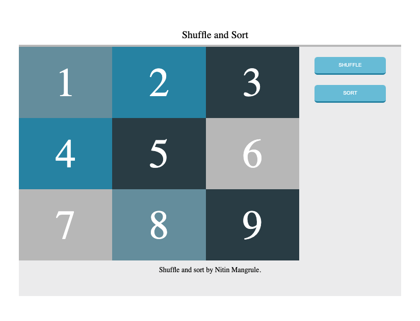
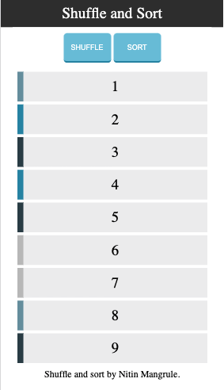

# Cards-Shuffle-JS

This application helps user to shuffle and sort Number cards. 
It consists of 9 numbered cards which can be manipulated by using the shuffle and short buttons.

## Live Demo

https://nitinmangrule.github.io/Cards-Shuffle-JS/

## Tech Stack

ES6/JS, HTML5,CSS3.

## Application screenshots

1. Desktop View:

2. Mobile View:

